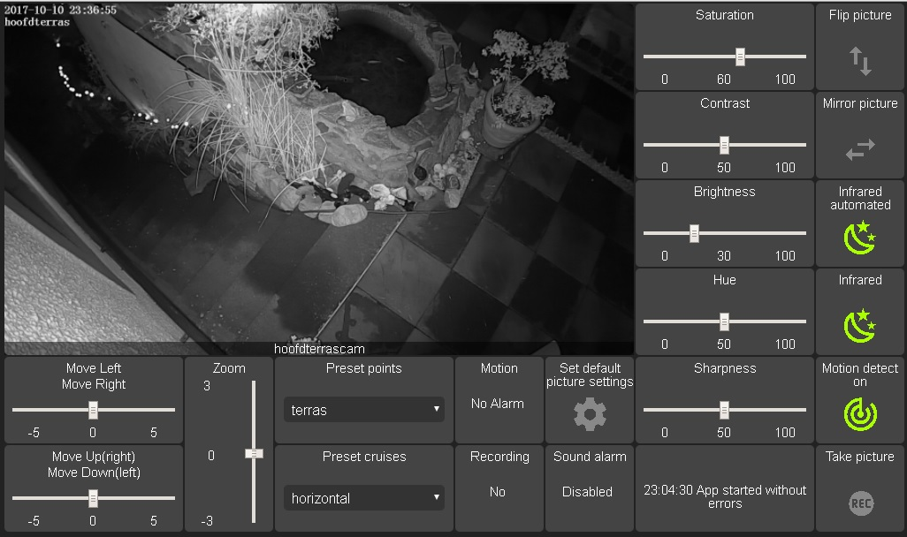
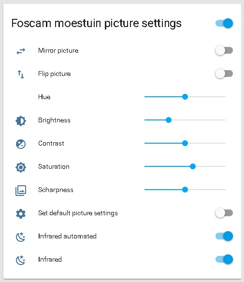

# This is an app to create controls for a foscam camera



## Cameratypes that work with this

i created 2 groups of cams that work with this app, but only group 1 has full functionality.

1) F19828P, F19828P V2, F19928P, R2, F19821W V2 
   cams that are PTZ and with infrared light controlled with type 2 CGI commands
2) C1 lite, C1 
   no PTZ cams without infrared
   
if your cam isnt here it can still work, but i dont know the type.
to check if your cam is from group 1 give this url in your browser:

   http://CAM_IP:CAM_POORT/cgi-bin/CGIProxy.fcgi?cmd=getDevState&usr=YOUR_USER_NAME&pwd=YOUR_PWD
   
if this gives back info then you can use the app with group 1 please contact me to add the camtype.

  
## Installation

- this app can only be used with a working version from Appdaemon (for installation from appdaemon see: http://appdaemon.readthedocs.io/en/latest/index.html ) it expects at least version 2.1.8
- besides appdaemon you need to install the custom widgets new_input_slider and vertical_ipnput_slider if you want a full working dashboard you can find them here: https://github.com/ReneTode/My-AppDaemon/tree/master/custom_widgets
- second requirement is untangle. to install untangle:
  pip3 install untangle
- you need to have the camera added and working in homeassistant
  https://home-assistant.io/components/camera.foscam/
- create in homeassistant the entities you can find in the file add_to_ha_configuration (input_boolean, input_sliders oder numbers and groups)

if all requirements are met you can install the app.
- download the file foscam.py and move it to your app directory from appdaemon
- in your apps.yaml create a new section with these arguments: (can be found in add_to_apps.yaml)
from version 0.55 homeassistant uses input_number instead of input_slider!!
(the settings here are only to show which settings are there and to tell what they are for. please use the settings from the subdir for homeassistant 0.55 or 0.54)

```
foscam:
  class: foscam
  module: foscam                           # the name of the py file you added to your apps
  camsettings:
    camera_type: F19828P V2                # give 1 of the known camera types
    camera_name: yourcam                   # the name you gave it in home assistant
    host: 192.168.1.50                     # the ip address from your cam
    port: '88'                             # the port from your cam (default is 88)
    password: yourpassword                 # password set for the cam (no strange symbols allowed)
    user: username                         # the username you use for the cam
  logsettings:
    loglevel: WARNING                      # setting this to INFO gets more info in the log
    logsensorlevel: WARNING                # the app creates a sensor with the last info. level can be changed
    last_error_sensor: sensor.foscam_last_error # the sensor is created automaticly
  picsettings:                             # these settings need to be created in home assistant (see below)
    brightness_slider: input_slider.foscam_brightness 
    contrast_slider: input_slider.foscam_contrast
    hue_slider: input_slider.foscam_hue
    saturation_slider: input_slider.foscam_saturation
    sharpness_slider: input_slider.foscam_sharpness
    default_pic_settings_switch: input_boolean.foscam_default_picture_settings
    flip_switch: input_boolean.foscam_flip
    mirror_switch: input_boolean.foscam_mirror
    auto_infrared_switch: input_boolean.foscam_auto_infrared
    infrared_switch: input_boolean.foscam_infrared
  ptzsettings:                             # these settings need to be created in home assistant (see below)
    left_right_slider: input_slider.foscam_left_right
    up_down_slider: input_slider.foscam_up_down
    start_cruise_select: input_select.foscam_preset_cruise
    stop_cruise_switch: input_boolean.foscam_stop_cruise
    zoom_slider: input_slider.foscam_zoom
    preset_points_select: input_select.foscam_preset_points
  alarmsettings:
    motion_sensor: sensor.foscam_motion    # the sensor is created automaticly
    motion_switch: input_boolean.foscam_motion_detect # also needs to be created in home assistant
    soundalarm_sensor: sensor.foscam_sound_alarm  # the sensor is created automaticly
    sensor_update_time: '10'               # the amount of time in seconds between checks from the cam
  recordsettings:
    snap_picture_switch: input_boolean.foscam_snap_picture_now  # also needs to be created in home assistant
    recording_sensor: sensor.foscam_recording  # the sensor is created automaticly
    save_snap_dir: /home/pi/foscam_snap/   # the dir where you want manual snapshots to be saved
  dashboardsettings: 
    use_dashboard: True                    # if this is set to False no dashboards will be created or used
    create_dashboard: True                 # creates a dashboard in your dashboard directory on initialize from the app
    create_alarm_dashboard: True           # creates an alarm dashboard
    dashboard_file_name: dash_terrascam    # the name that your dashboard gets
    alarm_dashboard_file_name: dash_terrascam_fullscreen # the name that the alarm dashboard gets
    screen_width: 1024                     # the screenwidth you want to use for your dashboard
    screen_height: 600                     # the screenheight you want to use for your dashboard
    show_full_screen_dashboard: True       # if you dont want to use the alarm dashboard set it to False
    full_screen_alarm_switch: input_boolean.foscam_toon_alarm_dash # a boolean to silence the alarmdashboard temperary
    time_between_shows: 60                 # minimum time in seconds between showing alarm dashboards
    show_time: 30                          # the amount of seconds the alarm keeps active
```


you can chose to let the app recreate the dashboard every time you start the app or when you are satisfied with the dashboard, or want to customize it, then set create_dashboard to false after the first time.

if you have done everything right you now can start your dashboard like http://your_dashboard_ip:dashboard_poort/dashboard_file_name

i welcome any feedback you can find discussion and help in this topic:
https://community.home-assistant.io/t/foscam-app-v2-appdaemon-and-hadashboard/29270

footnote: it is optional to set the dash_dir argument in appdaemon.yaml after installing appdaemon.
but untill i found a better way that setting is needed. if you dont want it at another place then set your dash_dir to /full/path/to//conf/dashboards

