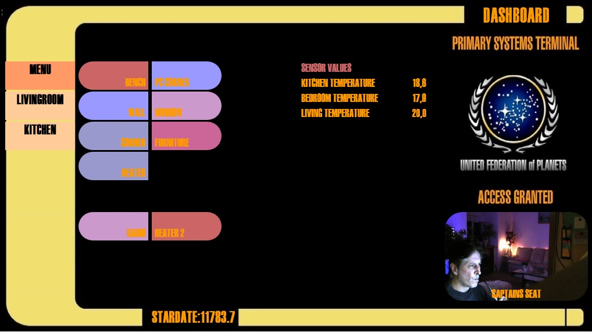

# The LCARS skin for HADashboard



using this skin is really easy if you have appdaemon/hadashboard installed.
all you need is a directory named custom_css in your conf(iguration) directory
there you create the lcars directory with the files in it and you are good to go.

the skin has a background that can be used with different resolutions.
i created example dashboards for 3 different resolutions, but you also can change the settings yourself.

here are the settings you need to change for different resolutions

## 800 x 480 (untested size)
- in variables.yaml set **screenwidth: 1024** to 800
- in dashboard.css change   **background-size: 1024px;** to 800
- in the dashboard use the settings:
```
  widget_dimensions: [93, 18]
  widget_margins: [5, 2]
```
  and you might need to change
  ```
stardate:
  container_style: "top: 6px" #6px for 1024, 18px for 1280, 28px for 1600
```
to get the stardate at the right position

## 1024 x 600 (default size)
- in the dashboard use the settings:
```
  widget_dimensions: [119, 23]
  widget_margins: [7, 3]
```
  and use
  ```
stardate:
  container_style: "top: 6px" #6px for 1024, 18px for 1280, 28px for 1600
```

## 1280 x 768
- in variables.yaml set **screenwidth: 1024** to 1280
- in dashboard.css change   **background-size: 1024px;** to 1280
- in the dashboard use the settings:
```
  widget_dimensions: [149, 29]
  widget_margins: [9, 4]
```
  and change
  ```
stardate:
  container_style: "top: 6px" #6px for 1024, 18px for 1280, 28px for 1600
```
to get the stardate at the right position

## 1600 x 900
- in variables.yaml set **screenwidth: 1024** to 1600
- in dashboard.css change   **background-size: 1024px;** to 1600
- in the dashboard use the settings:
```
  widget_dimensions: [86, 35]
  widget_margins: [11, 5]
```
  and change
  ```
stardate:
  container_style: "top: 6px" #6px for 1024, 18px for 1280, 28px for 1600
```
to get the stardate at the right position

## 2560 x 1600 (untested)
- in variables.yaml set **screenwidth: 1024** to 2560
- in dashboard.css change   **background-size: 1024px;** to 2560
- in the dashboard use the settings:
```
  widget_dimensions: [298, 61]
  widget_margins: [23, 11]
```
  and you might need to change
  ```
stardate:
  container_style: "top: 6px" #6px for 1024, 18px for 1280, 28px for 1600
```
to get the stardate at the right position
