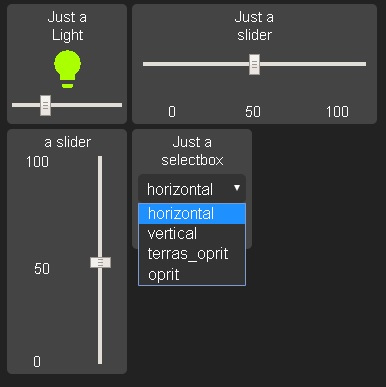

## these are custom widgets for HADashboard



place the files in the directory /conf/custom_widgets
edit in the skin the variables.yaml with the variables you can find in custom_css

usage in your dashboards:

```
title: Test dashboard
widget_dimensions: [120, 120]
widget_margins: [5, 5]
columns: 7

your_light:
  widget_type: light_with_brightness
  entity: light.any_light
  title: Just a
  title2: Light
your_vertical_slider:
  widget_type: vertical_input_slider
  entity: input_slider.your_slider
  title: Just a
  title2: slider
your_horizontal_slider:
  widget_type: new_input_slider
  entity: input_slider.your_slider2
  title: Just a
  title2: slider
your_input_select:
  widget_type: input_select
  entity: input_select.your_select
  title: Just a
  title2: selectbox


layout:
    - your_light, your_horizontal_slider(2x1)
    - your_vertical_slider(1x2), your_input_select
    
```

