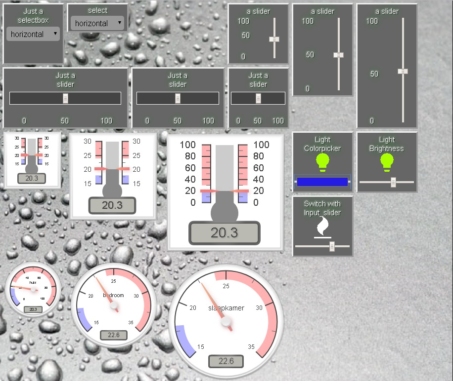

## these are custom widgets for HADashboard



### these widgets are for Appdaemon version 2.1.12
### Appdaemon version 3.0b has some of these widgets included. (radial, temperature, vertical_slider (called input_number) and input_select)

place the files in the directory /conf/custom_widgets

important! you need to use my custom skin waterdrops (to be found in custom css) or edit variables.yaml in your own skin or the default skin.   
the lines to add to the variables.yaml can be found on this github in custom_css/default/variables.yaml

to activate the temperature and radial widgets you need to download canvas gauges that can be found here:
https://github.com/Mikhus/canvas-gauges
install that in the directory conf/custom_css/gauge
in the variables.yaml from my waterdropsskill are the lines that point to that lib.
if you want to use them in your own skin then create these 2 lines:
```
 - <script src="/custom_css/gauge/gauge.min.js"></script>
 - <link rel="stylesheet" href="/custom_css/gauge/fonts/fonts.css">
```
in the head_includes section from your variables.yaml

the temperature and radial widget are fully customisable.
all settings you can use for them (like colors, ticks, needles, etc) can be found here:
https://canvas-gauges.com/documentation/user-guide/configuration#basic-options


usage in your dashboards:

```
title: Test dashboard
widget_dimensions: [120, 120]
widget_margins: [5, 5]
columns: 7

your_heater:
  widget_type: heater
  icon_entity: switch.any_switchtype_entity
  slider_entity: input_number.any_inputslider
  title: Just a
  title2: Heater
your_light:
  widget_type: light_with_brightness
  entity: light.any_light
  title: Just a
  title2: Light
your_light2:
  widget_type: light_with_colorpicker
  entity: light.any_light
  title: Just a
  title2: Light
your_vertical_slider:
  widget_type: vertical_input_slider
  entity: input_number.your_slider
  title: Just a
  title2: slider
your_horizontal_slider:
  widget_type: new_input_slider
  entity: input_number.your_slider2
  title: Just a
  title2: slider
your_input_select:
  widget_type: input_select
  entity: input_select.your_select
  title: Just a
  title2: selectbox
your_temperature:
  widget_type: temperature
  entity: sensor.your_sensor
  settings:
    minValue: 15
    maxValue: 30
    width: 120
    height: 120
    majorTicks: [15,20,25,30]
    highlights: [{'from': 15, 'to': 18, 'color': 'rgba(0,0, 255, .3)'},{'from': 24, 'to': 30, 'color': 'rgba(255, 0, 0, .3)'}]
your_radial:
  widget_type: radial
  entity: sensor.your_sensor
  settings:
    title: any title
    minValue: 0
    maxValue: 100
    majorTicks: [0,20,40,60,80,100]
    highlights: [{'from': 0, 'to': 18, 'color': 'rgba(0,0, 255, .3)'},{'from': 25, 'to': 100, 'color': 'rgba(255, 0, 0, .3)'}]


layout:
    - your_light, your_light2, your_horizontal_slider(2x1)
    - your_vertical_slider(1x2), your_input_select, your_heater
    - your_temperature, your_radial
    
```

## newest widget: iconsensor

the iconsensor let you show an icon for every value that an sensor can get.
you can use it for weathersensor or for an input_select or any sensor you like with multiple states.
in the dashboard you use it like this:

```
a_sensor_name:
    widget_type: iconsensor
    entity: sensor.your_sensor
    title: your title
    state_icons:
      night: mdi-brightness-3
      evening: mdi-sofa
      cloudy: mdi-weather-cloudy
      partly_cloudy: mdi-weather-partlycloudy
      sunny: mdi-weather-sunny
      morning: mdi-bike
    widget_style: "border-radius: 30px" #or some other css
```
    

